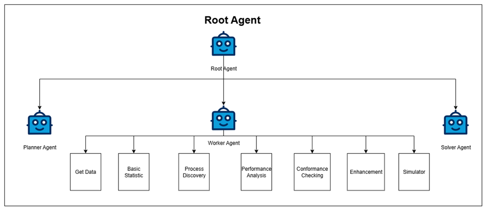
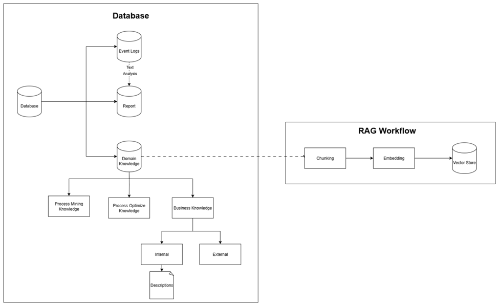
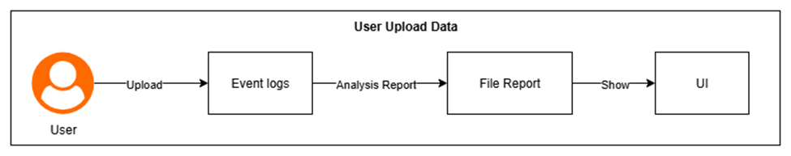
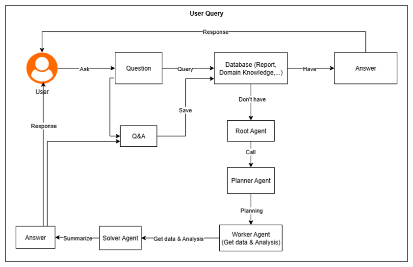
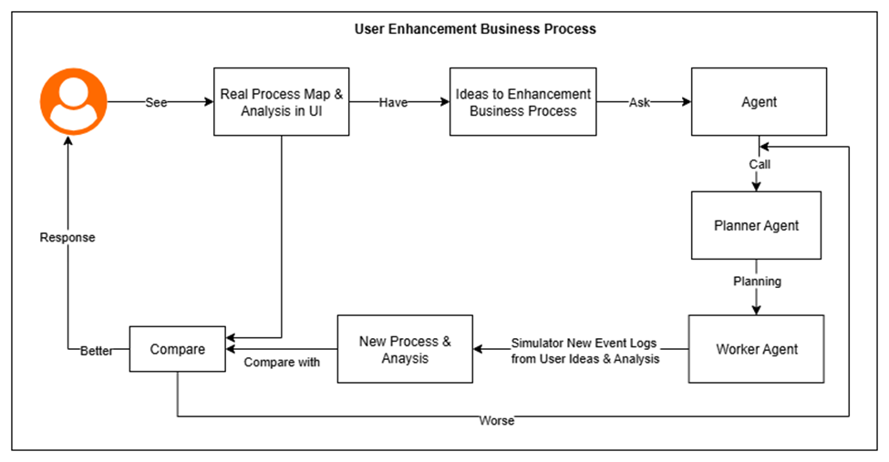
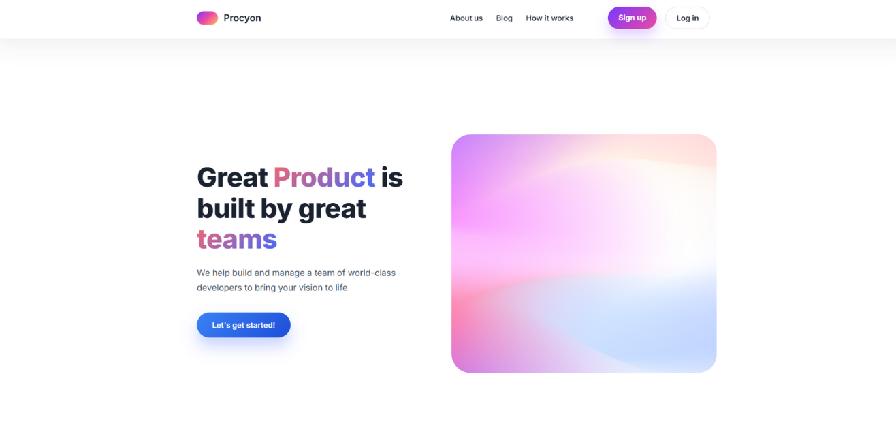
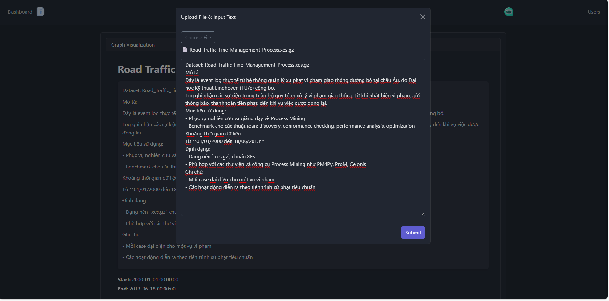
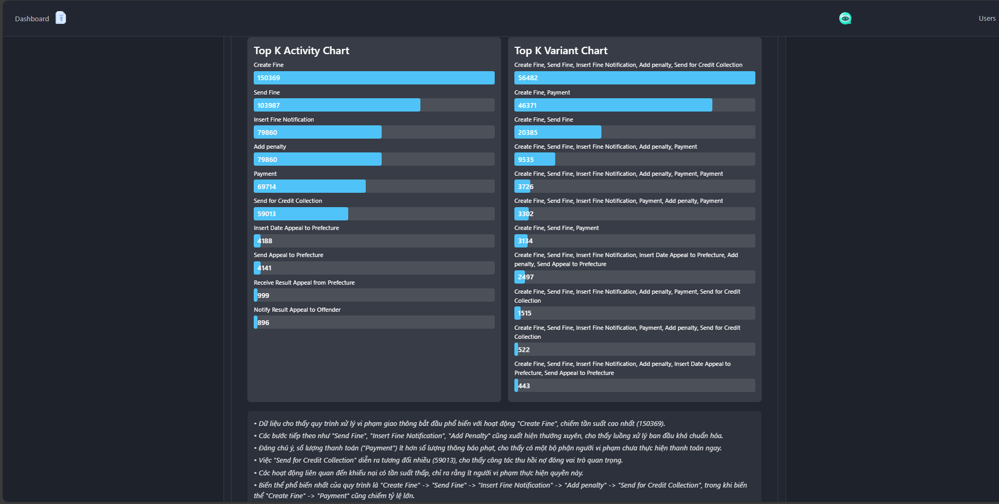
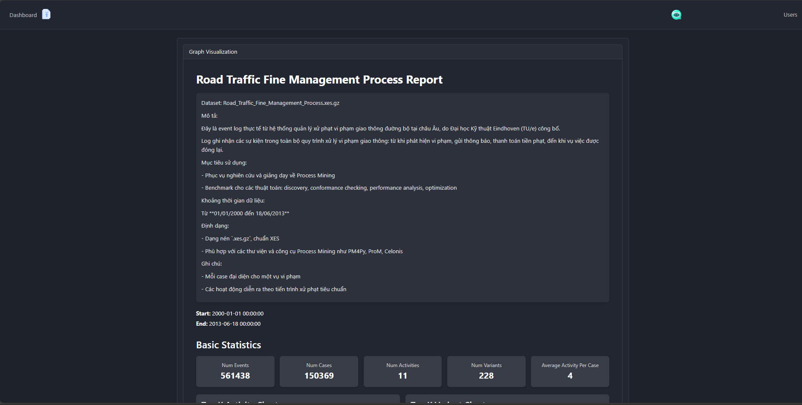
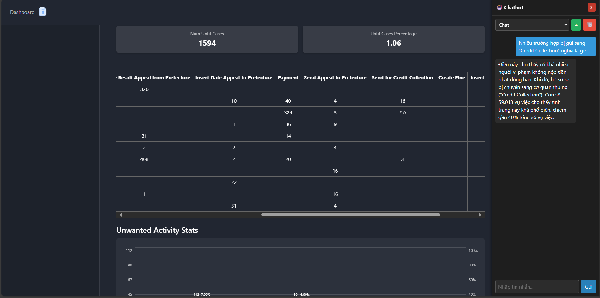

# 🧩 Process Mining Demo with FastAPI & pm4py

This project demonstrates **Process Mining** techniques using Python, FastAPI, and pm4py.  
It includes a backend that generates process graphs and serves them to a frontend dashboard.

---

## 📘 Table of Contents
1. [What is Process Mining?](#what-is-process-mining)  
2. [Tech Stack](#tech-stack)  
3. [Features](#features)  
4. [Project Structure](#project-structure)  
5. [Installation & Running](#installation--running)  
6. [Example Code](#example-code-fastapi-endpoint)  
7. [Example Graph](#example-graph)  
8. [System Diagrams](#system-diagrams)  
9. [UI Screenshots](#ui-screenshots)  
10. [Next Steps](#next-steps)  
11. [License](#license)

---

## 🧠 What is Process Mining?

Process Mining is a **data analysis technique** that focuses on event logs.  
Most software systems automatically store logs of user actions.  
For example:

```
User A: Browse Website → View Product → Add to Cart → Checkout
```

Each event typically contains:
- **User ID**
- **Activity Name**
- **Timestamp**

Instead of analyzing logs directly with averages or sums,  
Process Mining **reconstructs entire cases (user journeys)** by linking events of the same user together.

→ Each **case** = sequence of activities for a user.

This enables visualization and analysis of the **actual business process flow**.

---

## 🧰 Tech Stack

| Layer | Technology |
|-------|-------------|
| Backend | **Python 3.9+**, **FastAPI**, **pm4py**, **Graphviz** |
| Frontend | **React**, **TailwindCSS** |
| Optional Services | MongoDB, JWT Auth |
| Process Models | Directly-Follows Graph, Petri Nets, Alpha Miner, Heuristics Miner |

---

## ⚙️ Features

✅ Load and parse event logs (CSV / XES)  
✅ Transform logs into **process cases**  
✅ Generate **process models** (DFG, Petri Net, etc.)  
✅ Serve generated process graphs via **FastAPI endpoints**  
✅ React frontend dashboard for visualization  
✅ Ready for extension with **RAG-based analytics** or chatbot integration  

---

## 📂 Project Structure

```
TungTungTungSahur/
│── backend/
│   ├── main.py               # FastAPI server
│   ├── image.png             # Example generated graph
│── frontend/
│   ├── src/
│   │   ├── App.jsx           # React app entry
│   │   ├── components/...
│── README.md
```

---

## 🧭 Installation & Running

### 1️⃣ Clone the repository
```bash
git clone https://github.com/teaplusottp/MinerRanger
```

### 2️⃣ Install dependencies
```bash
# Root-level tools
npm install

# Backend (FastAPI/pm4py)
cd backend
pip install -r requirements.txt

# Frontend
cd ../frontend
npm install
```

### 3️⃣ Configure environment variables
Copy the sample file and set your values:
```bash
cp backend/.env.example backend/.env
```

**Required variables**
- `MONGO_URI` – MongoDB connection string  
- `JWT_SECRET` – Secret key for auth  
- `PORT` – (optional) Express API port  

See [`backend/.env.example`](backend/.env.example) for details.

### 4️⃣ Run the stack
```bash
npm start
```

This launches:
- FastAPI → [http://localhost:8000/](http://localhost:8000/)  
- Express API → [http://localhost:8080/](http://localhost:8080/)  
- Frontend → [http://localhost:5173/](http://localhost:5173/)

---

## 🔍 Example Code (FastAPI Endpoint)

```python
from fastapi import FastAPI
from fastapi.responses import FileResponse
from fastapi.middleware.cors import CORSMiddleware

app = FastAPI()

app.add_middleware(
    CORSMiddleware,
    allow_origins=["*"],
    allow_credentials=True,
    allow_methods=["*"],
    allow_headers=["*"],
)

@app.get("/graph")
async def get_graph():
    return FileResponse("image.png", media_type="image/png")
```

---

## 📊 Example Graph

Example of a **Directly-Follows Graph (DFG)** generated from event logs:

```
(A) → (B) → (C)
```

---

## 🖼️ System Diagrams

| Figure | Description | Image |
|---------|--------------|--------|
| **Hình 4.1** | Mô hình Root Agent và các Tác tử con |  |
| **Hình 4.2** | Cấu trúc Cơ sở dữ liệu và Luồng RAG Workflow |  |
| **Hình 4.3** | Luồng xử lý dữ liệu khi người dùng upload |  |
| **Hình 4.4** | Luồng hoạt động khi người dùng đặt truy vấn |  |
| **Hình 4.5** | Luồng cải tiến quy trình kinh doanh |  |

> 💡 All diagrams are stored under `docs/figures/` for easy access.

---

## 💻 UI Screenshots

| Figure | Page | Screenshot |
|---------|------|-------------|
| **Hình 6.1.a** | Trang Home |  |
| **Hình 6.1.b** | Trang Đăng ký |  |
| **Hình 6.1.c** | Trang Đăng nhập |  |
| **Hình 6.1.d** | Trang Upload dữ liệu |  |
| **Hình 6.1.e** | Trang Thống kê |  |
| **Hình 6.1.f** | Trang Thống kê |  |
| **Hình 6.1.g** | Chatbot trả lời truy vấn |  |

---

## 🚀 Next Steps

- [ ] Upload & parse CSV/XES logs from UI  
- [ ] Implement multiple miners (Alpha, Heuristics, Inductive)  
- [ ] Add chatbot for natural-language process insights  
- [ ] Improve graph interactivity & layout  

---

## 📜 License

MIT License © 2025 — Your Name
